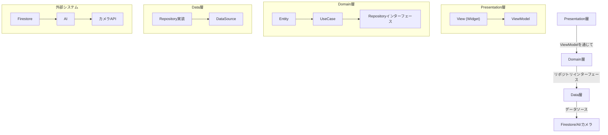

# komarigoto_app

A new Flutter project.

## Getting Started

This project is a starting point for a Flutter application.

A few resources to get you started if this is your first Flutter project:

- [Lab: Write your first Flutter app](https://docs.flutter.dev/get-started/codelab)
- [Cookbook: Useful Flutter samples](https://docs.flutter.dev/cookbook)

For help getting started with Flutter development, view the
[online documentation](https://docs.flutter.dev/), which offers tutorials,
samples, guidance on mobile development, and a full API reference.

## プロジェクト概要

このプロジェクトは、Flutterを使用して構築された食材在庫管理＆レシピ提案アプリです。以下の主要な機能を提供します：

- **食材の在庫管理**: 食材の追加、削除、編集、在庫状況の更新。
- **レシピ提案**: 在庫食材とユーザー条件に基づいたAIによるレシピ提案。
- **ユーザー設定**: 節約、健康、時短などの重視ポイントを設定可能。
- **レシピ検索・保存・シェア**: レシピの生成、保存、共有、ランキング機能。

## アーキテクチャ

このプロジェクトは、クリーンアーキテクチャを採用しています。以下は各層の役割を示した図です：



## ディレクトリ構成

```
/lib
  /presentation (screens, viewmodels, widgets)
  /domain (entities, usecases, repositories)
  /data (datasources, repositories_impl)
  /core (utils, errors)
  main.dart
/test
  ...（各レイヤのテスト）
```
