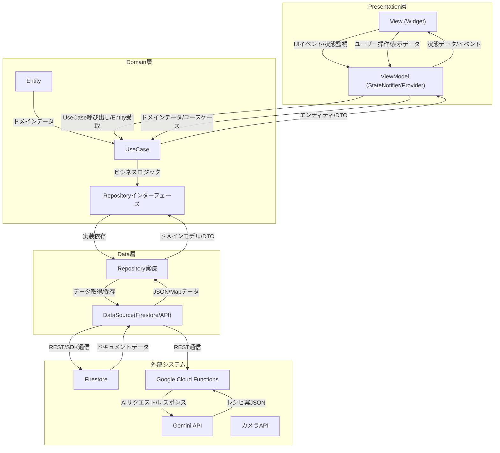

# komarigoto_app

A new Flutter project.

## プロジェクト概要

このプロジェクトは、Flutterを使用して構築された食材在庫管理＆レシピ提案アプリです。以下の主要な機能を提供します：

- **食材の在庫管理**: 食材の追加、削除、編集、在庫状況の更新。
- **レシピ提案**: 在庫食材とユーザー条件に基づいたAIによるレシピ提案。
- **ユーザー設定**: 節約、健康、時短などの重視ポイントを設定可能。
- **レシピ検索・保存・シェア**: レシピの生成、保存、共有、ランキング機能。

## アーキテクチャ

このプロジェクトは、クリーンアーキテクチャおよびMVVMパターンを採用しています。

### 構成図（マーメイド記法）



### 各モジュールの依存関係・データやり取り
- Presentation層（View, ViewModel）はDomain層のUseCase/Entityに依存し、状態やイベントをやり取りします。
- Domain層はRepositoryインターフェースを通じてData層に依存します。
- Data層は外部システム（Firestore, Cloud Functions, Gemini API等）とデータのやり取りを行います。
- データのやり取りは、エンティティ/DTO/Map/JSONなどで行われます。

## ディレクトリ構成

```
/lib
  /presentation (screens, viewmodels, widgets)
  /domain (entities, usecases, repositories)
  /data (datasources, repositories_impl)
  /core (utils, errors)
  main.dart
/test
  ...（各レイヤのテスト）
```
